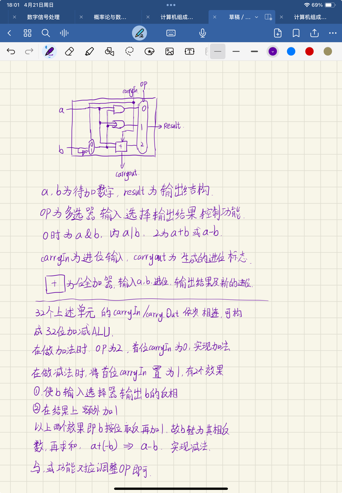

### 3.1
0x5ED4 = 0101 1110 1101 0100
0x07A4 = 0000 0111 1010 0100

      0101 1110 1101 0100
    - 0000 0111 1010 0100
    ------------------------
      0101 0111 0011 0000

转换为16进制：0x5730
     
### 3.2
0x5ED4 = 0101 1110 1101 0100
0x07A4 = 0000 0111 1010 0100
两个数的符号位都是0，因此都是正数，其补码等于原码

      0101 1110 1101 0100
    - 0000 0111 1010 0100
    ------------------------
      0101 0111 0011 0000

转换为16进制：0x5730

### 3.3
0x5ED4 = 0101 1110 1101 0100

16进制表示优点：
- 便于和2进制快速转换，2进制的4位数对应16进制的1位数
- 缩短2进制数的表示长度，使之更加简洁，便于阅读和书写

### 3.9
（此处假设题意为转化后的二进制数长度为八位）
转换为2进制：
151 -> 1001 0111
214 -> 1101 0110

      1001 0111
    + 1101 0110
    ------------
     10110 1101

求和结果为0110 1101，发生了溢出
由于题目要求进行饱和算数， 因此采用8位有符号数的最小值取代运算结果
综上所述，运算结果为1000 0000
转化为十进制：
（直接转化为十进制）：128
（按有符号数的值转化为十进制）：-128

### 3.10
（此处假设题意为转化后的二进制数长度为八位）
转换为2进制：
151 -> 1001 0111
214 -> 1101 0110
1101 0110 转化为相反数：0010 1010

      1001 0111
    + 0010 1010
    ------------
      1100 0001

没有溢出，因此不涉及饱和算数相关要求
综上所述，运算结果为1100 0001
转化为十进制：
（直接转化为十进制）：193
（按有符号数的值转化为十进制）：-63

### 3.20
**补码整数**
0x0C00 0000 = 0000 1100 0000 0000 0000 0000 0000 0000
由于符号位为零，因此这是一个正数，源码等于补码
转十进制：$1*2^{26}+1*2^{27} = 201326592$

**无符号整数**
0x0C00 0000 = 0000 1100 0000 0000 0000 0000 0000 0000
无符号数可以直接转换
转十进制：$1*2^{26}+1*2^{27} = 201326592$

### 3.21
0x0C00 0000 = 0000 1100 0000 0000 0000 0000 0000 0000
OP段为000011， 查表得此指令是jal指令，此后的26位为跳转的目标地址
则此指令具体执行的内容为， 将PC+4保存到$ra寄存器中，然后跳转到目标地址执行

### 3.22
0x0C00 0000 = 0000 1100 0000 0000 0000 0000 0000 0000
按照IEEE 754标准，这应该是一个单精度浮点数
符号位是0，说明这是正数
指数为 0001 1000，减去偏阶127（0111 1111），得实际指数为1001 1001，转换为十进制为-103
尾数为000 0000 0000 0000 0000 0000，加上隐含的1，故尾数为1
综上所述，转化为十进制为：
$1*2^{-103}$

### 3.23
将63.25转为2进制：11 1111.01
规格化：$1.1111101*2^{5}$
则尾数为1111101，指数为5，
指数加上偏阶为$5+127=132$
转换为2进制为1000 0100
原数为正数因此符号位为0
综上所述，转化为浮点数为：0100 0010 0111 1101 0000 0000 0000 0000
以16进制表示为0x427D 0000

### 3.24
将63.25转为2进制：11 1111.01
规格化：$1.1111101*2^{5}$
则尾数为1111101，指数为5，
指数加上偏阶为$5+1023 = 1028$
转换为2进制为100 0000 0100
原数为正数因此符号位为0
综上所述，转化为浮点数为：0100 0000 0100 1111 1010 0000 0000 0000 0000 0000 0000 0000 0000 0000 0000 0000
以16进制表示为0x404F A000 0000 0000

### 3.26
**转化为2进制**
转换为2进制：$-1.5625*10^{-1} = -0.00101$
ps: 题目中规定没有隐含的1，此处理解为将尾数化为整数
规格化为$101*2^{-5}$
指数为-5，尾数为101
指数转为12位补码表示：1111 1111 1011
尾数转为24位补码表示：0000 0000 0000 0000 0110 0101
综上所述，可表示为：1111 1111 1011 0000 0000 0000 0000 0110 0101
转化为16进制：0xFFB000065

**与IEEE 754 对比**
IEEE 754单精度浮点数范围为
$1*2^{-126}$ ~ $1.9999998807907104*2^{127}$和
$-1.9999998807907104*2^{127}$～$-1*2^{-126}$
双精度浮点数范围为
$1*2^{-1022}$ ~ $1.9999999999999964*2^{1023}$和
$-1.9999999999999964*2^{1023}$～$-1*2^{-1022}$
12位指数能表示的最小的值为-2048，最大值为2047
24位尾数能表示的最小值为-8388608，最大值为8388607
上述表示方法的范围为
$-8388608*2^{2047}$ ~ $-1*2^{-2048}$和
$1*2^{-2048}$～$8388607*2^{2047}$
通过对比，可以发现这种表示方法可以表示的范围远大于IEEE 754标准，同时一定程度上解决IEEE 754无法表示零附近的数的问题，可以表示更加逼近0的数。从精度角度来看，IEEE 754标准的两种尾数长度分别是23位和52位，而题述的表示方式尾数长度为12位，因此精度不如IEEE 754标准

### 3.27
**转化为2进制**
转换为2进制：$-1.5625*10^{-1} = -0.00101$
规格化为$1.01*2^{-3}$
指数为-3，尾数为01
指数加上偏阶为$-3+15 = 12$
转为5位2进制：01100
原数字为负数，因此符号位为1
综上所述，可表示为：1011 0001 0000 0000
转化为16进制：0xB100

**与IEEE 754 对比**
IEEE 754 标准的表示范围已在上题中展示，此处不再赘述
半精度浮点数的表示范围：
$1*2^{-14}$ ~ $1.9990234375*2^{15}$和
$-1.9990234375*2^{15}$～$-1*2^{-14}$
通过对比，可以发现这种表示方法可以表示的范围小于IEEE 754标准的单精度浮点数和双精度浮点数。从精度角度来看，IEEE 754标准的两种尾数长度分别是23位和52位， 而题述的表示方式尾数长度为10位，因此精度不如IEEE 754标准的单精度浮点数和双精度浮点数
### 扩展作业
#### 原码求补码
补码的设计目的是在有符号位的时候只有一种0的表示方式， 并且在加法时可以直接计算而无需处理符号位。 n位补码运算是模$2^n$运算，补码需要让负数和对应正数相加等于零，因此一个数x的补码为$2^n-x$（$2^n mod 2^n = 0$）。为了求$2^n-x$，考虑$2^n-1-x$， 这等价于一个n位的全是1的数减x，获得的值是x按位取反的结果，此时再将之前减掉的1加回来， 就获得了x的补码（$2^n-x$）。以上算法可总结为常见的转补码方法，也就是按位取反再加一。

#### 补码求相反数补码
一个数和它的相反数相加，要求和为零，对于一个N位数来说，求相反数就是求$2^n-x$（$2^n mod 2^n = 0$），为了求$2^n-x$，考虑$2^n-1-x$， 这等价于一个n位的全是1的数减x，获得的值是x按位取反的结果，此时再将之前减掉的1加回来， 就获得了x的补码（$2^n-x$）。以上算法可总结为常见的求相反数方法，也就是按位取反再加一。

#### 加减ALU设计

